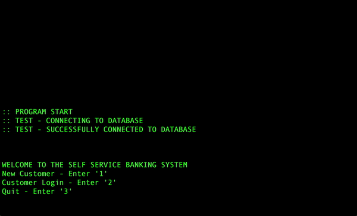
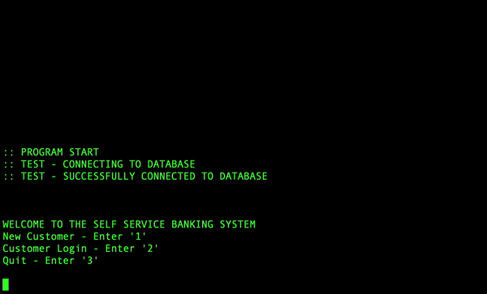
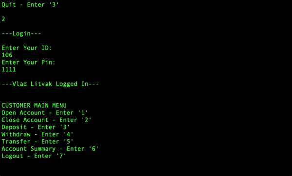
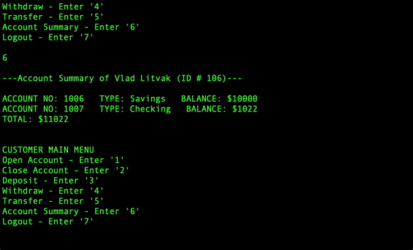

# Banking Database & UI

### [See Demos](#create-user)

### DESCRIPTION

- This program sets up a banking database in DB2 and gives users a command line UI to simulate an online banking portal.
- Users may interact with the portal by creating accounts, logging in, making transactions, etc.
- Admins may login with their credentials and will have access to system-wide reports.
 

### FILE INFO

- [**Create.sql**](Create.sql) initializes database tables storing customer information and account information.
- [**BankingSystem.java**](BankingSystem.java) establishes a connection to the database and defines customer functionality.
- [**BankUI.java**](BankUI.java) creates a command line UI for customers to interact with the banking system.
- [**UI Flowchart.pdf**](UI%20Flowchart.pdf) is a flowchart describing each menu's features and how the menus connect.
- The [**Stored Procedures**](/Stored%20Procedures) folder contains files for future development which shifts functionality to stored procedures in the database rather than JDBC code.
 

### BANKING PORTAL SPECS
  
- Logging in with ID: 0 and Pin: 0 logs in to the admin account.
- Customer ID's and Account Numbers are system generated starting at 100 and 1000 respectively, and increment by one with new creations.
- You can open an account in someone else's name (as long as they have a customer account), but you can not close someone else's account.
- The banking system only supports integers for balances, so the only valid inputs for withdraws, deposits, and transfers, are positive whole numbers.
- You can deposit from someone else's account, but you can only withdraw from your own accounts.
- You can transfer into any account as long as the source account is yours.
- For customer reports and administrative reports, closed accounts will not be included.
- Customer Account Summary:
  - includes account information about all of the customer's open accounts (Account Number, Type, and Balance), along with the total balance of all these accounts.
- Report A:
  - includes customer information of each customer in the Banking System (Name, ID, Age, Gender, and Total Balance), ordered by Total Balance in decreasing order.
- Report B:
  - calculates the average total balance of customers between two specified ages, inclusive (does not count customers with no open accounts).
 

### PROGRAM SETUP

- Initialize the BankDatabase database in your DB2 Instance using the DB2 command: 
  > `create db BankDatabase`
- Run [**Create.sql**](Create.sql) in your DB2 Instance. This sets up `Customer` and `Account` tables with appropriate attributes.
  - To reset the database, run [**Drop.sql**](Drop.sql) then [**Create.sql**](Create.sql) in your DB2 Instance.
- Edit [**db.properties**](db.properties) to contain your DB2 driver, url, instance username, and password.
- Place all files in the same directory on your machine.
- To run this program, in the command line, navigate to this directory and compile the java files:
  > `$ javac *.java`
- Make sure the db2 jdbc jar is in the class path, then run [**BankUI.java**](BankUI.java) with [**db.properties**](db.properties) as the argument:
  > `$ java -cp db2jcc4.jar BankUI  db.properties`
   - This will run the command line UI of the banking portal.
 

   
  <h2>Create User</h2>
  
   
   
  <h2>ID & Pin Verification</h2>
  
   
   
  <h2>Account Creation & Summary</h2>
  
   
   
  <h2>Transfer</h2>
  

